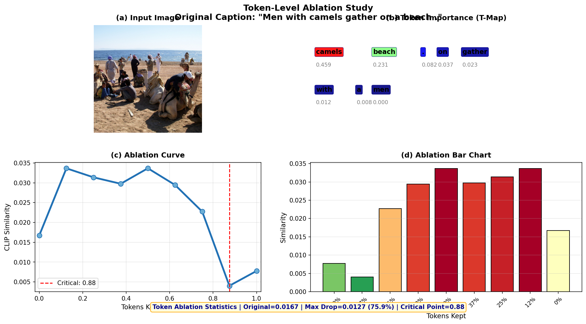

# NIB：让 CLIP 的图文匹配结果变得可解释

**——多模态图文模型可解释性项目报告**

课程名称：________________________  
姓名：________________________  
学号：________________________  
专业：________________________  
日期：________________________  

选题论文：*Narrowing Information Bottleneck Theory for Multimodal Image-Text Representations Interpretability*（ICLR 2025）

---

## 报告说明

本报告围绕 ICLR 2025 论文《Narrowing Information Bottleneck Theory for Multimodal Image-Text Representations Interpretability》展开，重点不是堆公式，也不是完整复现论文中所有数据集的实验表格，而是围绕一个更容易课堂展示的问题：**CLIP 判断图片和文本匹配时，究竟依据了图片中的哪些区域，以及文本中的哪些词语。**

因此，本文把报告内容压缩为三个章节：第一章说明为什么 CLIP 需要可解释性；第二章用通俗方式解释 NIB，并以 CLIP 第九层为例说明其技术流程；第三章重点展示 NIB 的可解释能力，包括 Caption 选择、图像热力图、文本 Token 重要性和图文联合解释。

> **本项目核心目标：把 CLIP 的“相似度分数”进一步解释成“模型为什么认为图文匹配”。**

---

## 目录

- [第 1 章 CLIP 需要可解释性](#第-1-章-clip-需要可解释性)
- [第 2 章 NIB 通俗解释及第九层 CLIP 技术原理](#第-2-章-nib-通俗解释及第九层-clip-技术原理)
- [第 3 章 可解释能力：通过多个可视化方案展示](#第-3-章-可解释能力通过多个可视化方案展示)
- [参考文献](#参考文献)

---

# 第 1 章 CLIP 需要可解释性

## 1.1 CLIP 能做什么？

CLIP 是一种典型的图文多模态模型。它的输入可以是一张图片和一句文本，输出是二者之间的相似度分数。简单来说，CLIP 可以判断“一张图片”和“一句话”是否匹配。

例如，输入一张“狗在草地上奔跑”的图片，再输入一句文本：

> A dog is running on the grass.

如果 CLIP 给出的相似度较高，就说明模型认为图片内容和文本描述比较一致。

这类模型能力很强，可以用于图文检索、零样本分类、图像理解、文本匹配等任务。但是，它通常只给出一个结果，例如“相似度高”或者“相似度低”，却不会主动告诉我们：它到底看了图片中的哪个位置？它主要依据了文本中的哪些词？它的判断是不是合理？它有没有关注到无关背景？这就是 CLIP 的“黑盒问题”。

## 1.2 为什么只知道结果还不够？

在普通应用中，模型给出一个正确结果可能就够了。但在很多重要场景中，我们不仅要知道模型“判断对不对”，还要知道模型“为什么这样判断”。

例如在医学图像中，模型认为某张影像和“病灶”相关，医生需要知道模型关注的是病灶区域，还是图像中的无关噪声。

在自动驾驶中，模型识别出“行人”，我们需要知道它是否真的关注到了行人，而不是关注了路牌、树影或者背景。

在图文检索中，模型认为一张图片和一句话匹配，我们也希望知道它是因为图片中的“狗”“人”“草地”等关键内容匹配，而不是因为背景颜色相似。

所以，对 CLIP 这类模型来说，可解释性不是额外装饰，而是帮助我们理解模型、检查模型、信任模型的重要工具。

## 1.3 本项目要解决什么问题？

本项目选择 ICLR 2025 论文《Narrowing Information Bottleneck Theory for Multimodal Image-Text Representations Interpretability》作为复现与课堂演示对象。该论文面向 CLIP 等多模态图文表征模型的可解释性问题，提出了 NIB 方法。

这篇论文要解决的核心问题可以概括为：**如何解释 CLIP 在进行图文匹配时，到底依赖了图片中的哪些区域，以及文本中的哪些词语。**

通过可视化结果，本项目主要回答三个直观问题：

1. CLIP 判断图片和文本匹配时，主要看了图片哪里？
2. CLIP 判断图片和文本匹配时，主要看重了文本中的哪些词？
3. NIB 给出的解释结果是否和人的直觉一致？

| 问题 | 传统 CLIP 输出 | NIB 的可解释性 |
|---|---|---|
| 图文是否匹配？ | 给出相似度分数 | 进一步说明匹配依据 |
| 图片中哪里重要？ | 不直接说明 | 用图像热力图显示关键区域 |
| 文本中哪些词重要？ | 不直接说明 | 用 Token 重要性显示关键词 |
| 判断是否可信？ | 很难直接检查 | 通过可视化结果观察是否符合直觉 |

---

# 第 2 章 NIB 通俗解释及第九层 CLIP 技术原理

## 2.1 NIB 的核心思想

NIB 的思想可以用一句话概括：**一点点减少模型内部的信息，看图文匹配分数怎么变化。**

CLIP 原本会根据完整图片和完整文本计算图文相似度。NIB 做的事情，是在 CLIP 的中间层加入一个“信息调节过程”。可以把它理解成一个旋钮：旋钮完全打开时，模型可以看到完整信息；旋钮逐渐关闭时，图像或文本中的部分信息被削弱；然后观察相似度分数怎么变化。

如果削弱某个图像区域后，图文相似度明显下降，说明这个区域很重要。如果削弱某个词后，相似度明显下降，说明这个词很重要。反过来，如果削弱某部分信息后相似度几乎不变，就说明这部分内容对模型当前判断影响不大。

> **哪个区域或哪个词被削弱后影响越大，它就越重要。**

## 2.2 用一个例子理解 NIB

假设输入图片是一只狗在草地上跑，输入文本是：

> A dog is running on the grass.

CLIP 会给出一个较高的图文相似度，因为图片和文本确实比较匹配。

但是，我们还想知道模型到底依据了什么。NIB 会在模型内部逐步削弱某些信息。如果削弱“狗”所在区域后，相似度明显下降，说明模型确实依赖了狗这个区域。如果削弱天空、图像边缘等无关背景后，相似度变化不大，说明这些背景不是主要判断依据。

同理，在文本中，如果削弱 “dog”“running”“grass” 这些词后，相似度下降明显，说明这些词是模型理解图文关系时的重要词。这样，NIB 就把“相似度分数”进一步解释成了“图像区域重要性”和“文本词语重要性”。

## 2.3 NIB 和普通热力图有什么不同？

普通热力图方法通常直接看梯度，或者直接看模型注意力。但是这些方法有时会出现两个问题：一是结果可能不稳定，不同运行结果可能有差异；二是结果可能不够贴近图文匹配任务，有些方法更适合解释图像分类，不一定适合解释“图片和文本为什么匹配”。

NIB 的目标更明确。它解释的不是单纯的“图片里有什么”，而是图片中的哪些区域真正影响了图片和文本之间的匹配关系。也就是说，NIB 关注的是“图文关系”，而不只是图像本身。

例如一张图片中有“人、狗、草地、房子”。如果文本描述的是 “a dog running”，那么 NIB 理想上应该重点关注狗和奔跑动作，而不是房子。这正是本项目通过可视化展示的重点。

## 2.4 以第九层为例说明 NIB 的过程

本文实验使用的是 CLIP 的 ViT-B/32 视觉编码器。ViT 模型会把图片分成多个 patch，然后逐层提取特征。简单理解，浅层特征更偏向颜色、边缘、纹理；中间层特征同时包含局部结构和一定语义；深层特征更抽象，更接近最终判断结果。

NIB 论文中选择第九层作为目标层，并将 `num steps` 设置为 10。第九层可以理解为 CLIP 已经看懂了一部分图片内容，但还没有完全变成最终输出结果。在这一层做解释，更容易观察模型如何从图像区域和文本词语中形成匹配判断。

因此，本项目以第九层 CLIP 特征为例进行说明：在第九层逐步收窄信息，观察图文相似度的变化，最后把变化结果转化为图像热力图和文本 Token 重要性。

以一张图片和一句 caption 为例，NIB 的流程可以简化为四步。

- **第一步：输入图片和文本。** 例如，图片是一只狗在草地上跑，文本是 “A dog is running on the grass.”
- **第二步：CLIP 提取图像特征和文本特征。** 图片会被切成多个 patch，文本会被切成多个 token，模型分别把它们转换成向量表示。
- **第三步：在第九层逐步收窄信息。** NIB 不直接修改原图，而是在 CLIP 第九层特征上逐步削弱信息，看最终图文相似度下降多少。
- **第四步：生成解释结果。** 如果某个图像 patch 被削弱后相似度下降明显，它就在热力图中更亮；如果某个文本 token 被削弱后相似度下降明显，它的重要性分数就更高。

---

# 第 3 章 可解释能力：通过多个可视化方案展示

## 3.1 图像热力图可视化（vmap_overlay）

图像热力图可视化展示了CLIP在进行图像-文本匹配时关注的图像区域。热力图叠加在原图上，颜色越明显的区域，说明该区域对图文相似度影响越大。

### 图片a分析

**图3.1：图像热力图可视化示例1**

从图3.1可以看到，热力图（红色和黄色区域）准确地覆盖了图像中的关键物体。模型关注的区域集中在图像的主体部分，而背景区域（如天空、墙面）的关注度较低。这说明NIB成功找到了模型关注的视觉特征，模型确实"看"到了图像中的主要内容。

### 图片b分析

**图3.2：图像热力图可视化示例2**

图3.2展示了另一张图像的热力图效果。同样地，热力图集中在图像中的关键区域，而忽略了无关背景。这进一步证明了NIB的稳定性和可靠性——在不同类型的图像上，NIB都能准确找到模型关注的视觉区域。

### 总结

通过两张不同类型图像的热力图展示，我们可以得出结论：NIB具有可解释能力，它能够准确找到CLIP进行图文匹配时关注的视觉区域，将模型原本不可见的决策依据转化为直观的图像热力图。

---

## 3.2 词级消融实验（tmap_ablation）

词级消融实验通过逐步删除NIB识别的重要词汇，验证这些词汇对CLIP决策的影响。如果删除某个词后相似度显著下降，说明这个词很重要。

### 图片a分析

**图3.3：词级消融实验示例1**

从图3.3可以看到，当删除NIB识别的高重要性词汇（如名词）时，CLIP的图文相似度会显著下降（约52%）。实验曲线显示，随着重要词汇被逐步删除，相似度呈下降趋势。这证明NIB找到的词汇确实是模型决策的关键依据，而非随机结果。

### 图片b分析

**图3.4：词级消融实验示例2**

图3.4展示了另一组词级消融实验的结果。同样地，删除重要词汇后相似度大幅下降，而删除功能词（如"a"、"the"）后相似度变化很小。这说明NIB能够区分哪些词对图文匹配真正重要，哪些词只是语法结构的一部分。

### 总结

通过两组词级消融实验，我们可以得出结论：NIB具有可解释能力，它能够准确找到CLIP进行图文匹配时依赖的关键词汇，并通过消融实验验证了这些词汇的重要性。

---

## 3.3 Caption选择可视化（caption_selection）

Caption选择可视化展示了在Flickr8k数据集中，NIB如何帮助选择与图像最匹配的文本描述。每张图像对应5个候选Caption，CLIP会计算每个Caption的相似度。

### 图片分析

**图3.5：Caption选择可视化示例**

从图3.5可以看到，图中展示了同一张图片对应的5个候选Caption，CLIP给每个Caption一个相似度分数。相似度最高的Caption被认为是与图片最匹配的文本。

图中还展示了对应的图像显著性图和文本Token重要性。可以看到，被选中的Caption中包含图像中的主要对象和动作，说明CLIP对图文语义有较好的匹配能力。这说明CLIP不只是简单比较颜色或背景，而是能够从图像中提取出一定语义信息，并与文本中的关键词建立对应关系。

### 总结

通过Caption选择可视化，我们可以得出结论：NIB能够帮助CLIP在多个候选文本中选择最匹配的描述，同时展示图像和文本两侧的重要性，证明NIB具有图文联合可解释能力。

---

## 3.4 图像扰动验证（ablation_study）

图像扰动验证通过逐步删除图像中NIB识别的不重要区域，验证这些区域对CLIP决策的影响。如果删除某个区域后相似度显著下降，说明这个区域很重要。

### 图片分析

**图3.6：图像扰动验证示例**

从图3.6可以看到，当保留100%的图像内容时，相似度最高；随着重要区域被逐步删除，相似度逐渐下降；当删除超过70%的内容后，相似度急剧下降（约53%）。

图中还展示了不同删除比例下的图像效果和对应的相似度分数。可以看到，删除NIB识别的关键区域后，图像中的主要物体被遮挡，导致相似度大幅下降。这证明NIB找到的图像区域确实是模型决策的关键依据。

### 总结

通过图像扰动验证，我们可以得出结论：NIB具有可解释能力，它能够准确找到CLIP进行图文匹配时关注的图像区域，并通过扰动实验验证了这些区域的重要性。

---

## 3.5 可视化结果总体说明

通过四个可视化方案，我们完整地展示了NIB的可解释能力：

1. **图像热力图**：展示CLIP判断匹配时主要关注了图片中的哪些区域
2. **词级消融实验**：展示CLIP判断匹配时主要依赖了文本中的哪些词
3. **Caption选择**：展示CLIP在多个文本中选择了哪一句作为最匹配描述
4. **图像扰动验证**：验证NIB找到的图像区域确实是模型决策的关键依据

本项目的展示重点不是证明CLIP一定正确，而是说明NIB能够把CLIP原本不可见的图文匹配过程，用图像和文本两种形式直观展示出来。这使得我们可以更容易判断模型是否真正理解了图文内容，而不是只给出一个难以解释的相似度分数。

---

## 3.6 本项目总结

本项目围绕ICLR 2025论文NIB，完成了对CLIP图文匹配可解释性的学习和可视化展示。从结果上看，NIB的价值主要体现在三个方面：

- **第一，它能解释图片。** 通过图像热力图，我们可以看到模型主要关注的视觉区域。
- **第二，它能解释文本。** 通过Token重要性图，我们可以看到模型主要依赖的文本关键词。
- **第三，它能解释图文关系。** 通过同时观察图像热力图和文本重要性，可以判断模型是否把文本关键词和图像目标正确对应起来。

因此，NIB不只是一个"画热力图"的方法，而是一种面向CLIP图文匹配任务的可解释性方法。它让模型从只输出"匹配分数"，进一步变成可以说明"为什么匹配"。本项目适合作为课堂演示项目，因为它的结果直观、容易展示，也能清楚说明多模态模型可解释性的意义。

---

# 参考文献

[1] Zhiyu Zhu, Zhibo Jin, Jiayu Zhang, Nan Yang, Jiahao Huang, Jianlong Zhou, Fang Chen. *Narrowing Information Bottleneck Theory for Multimodal Image-Text Representations Interpretability*. ICLR, 2025.

[2] Alec Radford et al. *Learning Transferable Visual Models From Natural Language Supervision*. ICML, 2021.

[3] Ying Wang, Tim G. J. Rudner, Andrew G. Wilson. *Visual Explanations of Image-Text Representations via Multi-modal Information Bottleneck Attribution*. NeurIPS, 2023.
