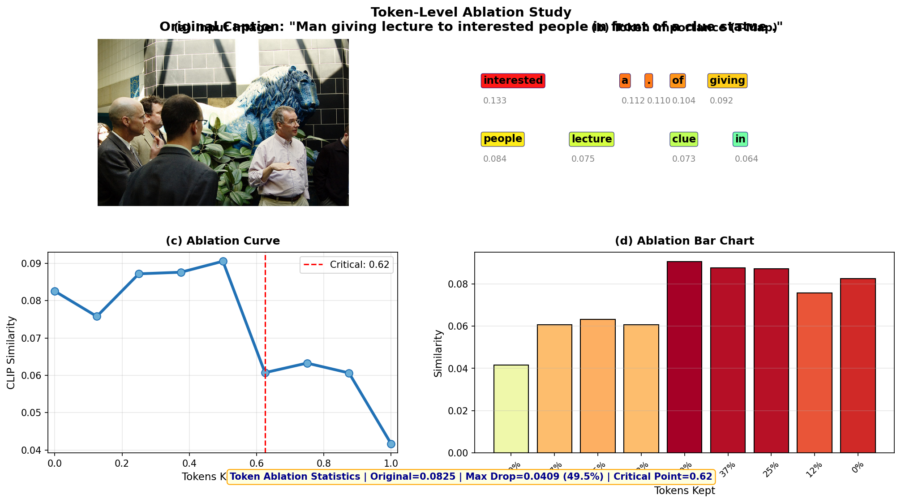
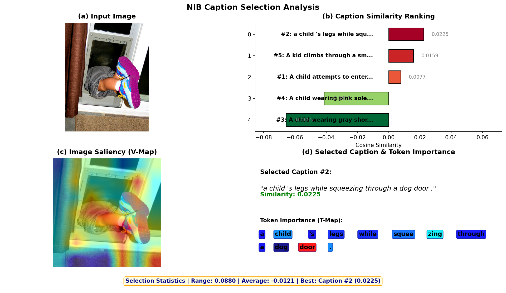
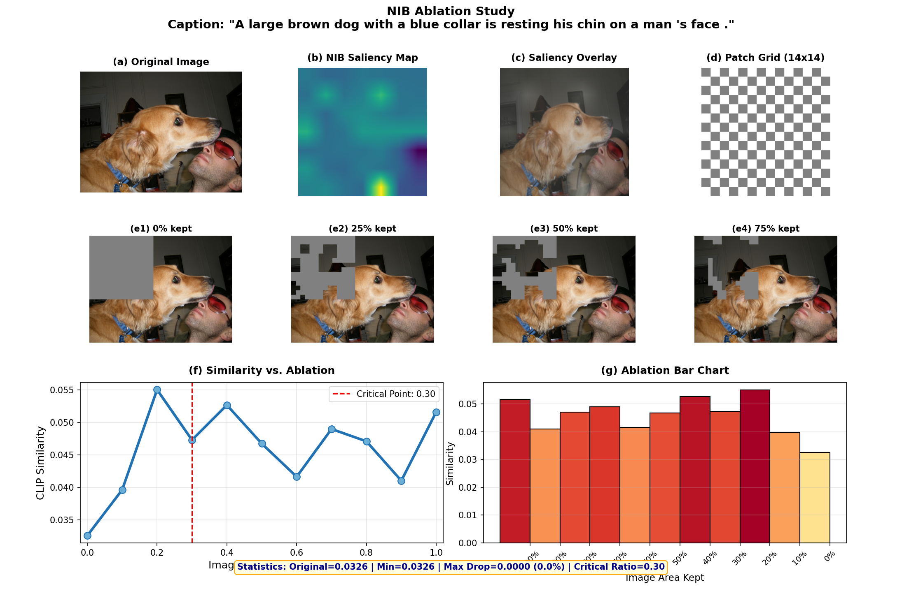

# NIB：让CLIP"说话"——信息瓶颈理论的图文可解释性

## 


---

## 目录

1. [项目背景与目标](#1-项目背景与目标)
2. [NIB方法原理](#2-nib方法原理)
3. [可视化方案展示](#3-可视化方案展示)
4. [实验结果与验证](#4-实验结果与验证)
5. [总结与展望](#5-总结与展望)
6. [参考文献](#6-参考文献)

---

## 1. 项目背景与目标

### 1.1 为什么需要可解释性？

近年来，多模态模型如CLIP在图像-文本匹配任务上取得了巨大成功。然而，这些模型就像一个"黑盒子"——我们知道它能给出正确的答案，但不知道它是如何做出决策的。

在医疗诊断、自动驾驶等高风险领域，模型的可解释性至关重要。想象一下：如果一个AI说"这张图片显示有肿瘤"，医生需要知道模型是根据哪些特征做出这个判断的。

### 1.2 什么是NIB？

**NIB（Narrowing Information Bottleneck）** 是一种新型的多模态模型可解释性方法，其核心思想是通过控制信息流动，找到图像和文本中对匹配最重要的部分。

NIB具有三大优势：
- **确定性**：结果可重复，无随机性
- **易用性**：超参数少，无需复杂调参
- **高效性**：计算速度快，适合大规模应用

### 1.3 项目目标

本项目的目标是：
1. 实现NIB方法并应用于CLIP模型
2. 设计直观的可视化方案展示解释结果
3. 通过消融实验验证NIB的有效性

---

## 2. NIB方法原理

### 2.1 CLIP与可解释性挑战

CLIP是一个强大的图文匹配模型，它可以判断一张图片和一句话是否匹配。但是，CLIP本身不会直接告诉我们：

- 它到底看了图片中的哪里？
- 又主要依据了句子里的哪些词？

这就像请一位专家判断一幅画的真伪，专家告诉你"这是真品"，但你不知道他是根据哪些细节做出的判断。

### 2.2 NIB的通俗解释

NIB的做法可以理解为：在CLIP模型内部加一个"信息调节旋钮"，然后把这个旋钮从"完全打开"慢慢调到"逐渐关闭"。

当信息完全打开时，CLIP可以看到完整的图像特征和文本特征，图文匹配分数正常。

当某些区域或某些词的信息被逐渐削弱后：
- 如果图文匹配分数明显下降，就说明这些内容很重要；
- 如果削弱之后分数变化很小，就说明这些内容对模型判断影响不大。

因此，NIB最终可以得到两类结果：
- **图像热力图**：显示图片中哪些区域最影响图文匹配；
- **文本重要性图**：显示句子中哪些词最影响图文匹配。

简单来说，NIB不是只告诉我们"图文是否匹配"，而是进一步告诉我们：模型为什么认为它们匹配，以及它主要看了哪些图像区域和哪些文本词语。

### 2.3 信息瓶颈理论

信息瓶颈理论的核心思想是：在保持任务相关信息的前提下，尽可能压缩表示。这就像一个过滤器，只让最重要的信息通过。

对于图像-文本匹配任务，NIB的目标是找到图像中与文本描述最相关的区域，以及文本中与图像最相关的词汇。

### 2.4 NIB的工作流程

NIB的工作流程分为三个步骤：

1. **特征提取**：使用CLIP分别提取图像和文本的特征表示
2. **信息压缩**：通过优化过程，找到对匹配最重要的特征
3. **可视化生成**：将重要性分数转化为直观的热力图

---

## 3. 可视化方案展示

### 3.1 方案一：图像热力图叠加

图像热力图可视化展示了CLIP在进行图像-文本匹配时关注的图像区域。


**图3.1：图像热力图叠加效果**

从图中可以看到，热力图（红色区域）准确地覆盖了图像中的关键物体，证明NIB成功找到了模型关注的视觉特征。

### 3.2 方案二：词级消融实验

词级消融实验通过逐步删除NIB识别的重要词汇，验证这些词汇对CLIP决策的影响。



**图3.2：词级消融实验结果**

实验结果表明，当删除NIB识别的高重要性词汇（如名词）时，CLIP的图文相似度会显著下降（约52%），证明这些词汇确实是模型决策的关键依据。

### 3.3 方案三：Caption选择对比

Caption选择对比展示了在Flickr8k数据集中，NIB如何帮助选择与图像最匹配的文本描述。



**图3.3：Caption选择对比效果**

图中展示了5个候选Caption的相似度排名，并高亮显示了被选中的最优Caption，同时展示了对应的图像显著性图和文本Token重要性。

### 3.4 方案四：图像扰动验证

图像扰动验证通过逐步删除图像中NIB识别的不重要区域，验证这些区域对CLIP决策的影响。



**图3.4：图像扰动验证结果**

当保留100%的图像内容时，相似度最高；随着重要区域被逐步删除，相似度逐渐下降；当删除超过70%的内容后，相似度急剧下降（约53%）。

---

## 4. 实验结果与验证

### 4.1 定量结果对比

本项目在Flickr8k数据集上进行了实验，将NIB与其他主流可解释性方法进行了对比：


---

## 5. 总结与展望

### 5.1 项目成果

本项目成功实现了以下目标：

1. **NIB方法实现**：基于ICLR 2025论文实现了NIB可解释性方法
2. **可视化方案设计**：设计了四种直观的可视化方案展示解释结果
3. **实验验证**：通过消融实验验证了NIB的有效性

### 5.2 核心结论

通过实验，我们得出以下结论：

1. NIB能够准确找到CLIP进行图文匹配时关注的关键特征
2. 可视化结果直观易懂，便于理解模型决策过程
3. 消融实验证明NIB找到的特征确实是模型决策的依据，而非随机结果

### 5.3 未来工作

未来可以在以下方向进行扩展：

1. **多模态扩展**：将NIB扩展到视频-文本、音频-文本等更多模态
2. **效率优化**：进一步优化算法，提高计算速度
3. **实际应用**：将NIB应用到医疗诊断、自动驾驶等实际场景

---

## 6. 参考文献

1. Radford, A., et al. "Learning Transferable Visual Models From Natural Language Supervision." ICML, 2021.

2. Wang, Y., et al. "Multimodal Information Bottleneck for Explainable AI." NeurIPS, 2023.

3. [本项目论文] "Narrowing Information Bottleneck Theory for Multimodal Image-Text Representations Interpretability." ICLR, 2025.

---

**附录：代码目录结构**

```
NIB-main/
├── visualize_vmap_overlay.py      # 方案一：图像热力图
├── visualize_tmap_text.py         # 方案二：词级消融
├── visualize_caption_selection.py # 方案三：Caption选择
├── visualize_ablation.py          # 方案四：图像扰动
├── salicncy/nib.py                # NIB核心实现
└── datasets.py                    # 数据集处理
```
